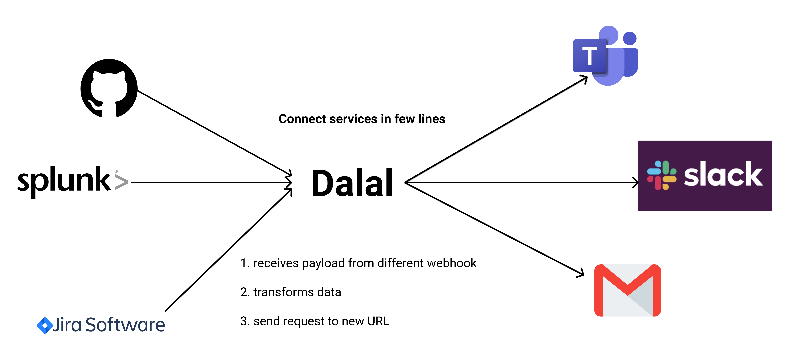

<!-- PROJECT LOGO -->
<br />
<div align="center">
  <h1>🦹 Dalal 🦹</h1>

  <p align="center">
    <b>BYOL* Payload Transormation Service</b>
    <br/>
    (*Bring Your Own Language 👻)
    <br /><br />
    <a href="https://master.d2r6jsqlksznst.amplifyapp.com/"><strong>Try it out »</strong></a>
    <br /><br />
    <a href="https://github.com/ghostwriternr/dalal/issues">Report Bug</a>
    ·
    <a href="https://github.com/ghostwriternr/dalal/issues">Request Feature</a>
  </p>
  
</div>

<!-- TABLE OF CONTENTS -->

## Table of Contents

- [About the Project](#about-the-project)
  - [Key Features](#key-features)
  - [Built With](#built-with)
- [Usage Instructions](#usage-instructions)
- [Getting Started](#getting-started)
  - [Prerequisites](#prerequisites)
  - [Running Dalal locally](#running-dalal-locally)
- [Roadmap](#roadmap)
- [Contributing](#contributing)
- [Credits](#credits)

## About The Project


Dalal is a powerful, in-flight webhook transformation service to connect absolutely any 2 services with very few lines of code - writen in your favourite language!

### Key Features:

- Only expects a simple transformation function to convert the source payload to your destination service.
- Runs on top of [OpenFaaS](https://www.openfaas.com/), so every language supported on OpenFaaS is supported.
- Detailed logs of past deliveries & errors with statistics.

### Built With

- [Ruby on Rails](https://rubyonrails.org/) and [Sidekiq](https://github.com/mperham/sidekiq)
- [OpenFaas](https://www.openfaas.com/)
- [Postgres](https://www.postgresql.org/)
- [React](https://reactjs.org/) with [TS](https://www.typescriptlang.org/) & [Styled Components](https://styled-components.com/)
- [Ant Design](https://ant.design/docs/react/introduce) and [Nivo](https://nivo.rocks/)

## Usage Instructions

1. Create a new channel from the home page.
2. Write a transformation function in any language desired, which will take in the data passed when the webhook is called, and use that to forward the data to desired service in the required format.
3. Add the url of the desired service, where you want to forward the request, in the target URL.
4. Click on Save.

## Getting Started

### Prerequisites

- [Docker](https://docs.docker.com/get-docker/) & [Docker Compose](https://docs.docker.com/compose/install/)
- [Docker Hub account](https://hub.docker.com/) (Other registries to be supported soon)
- [OpenFaaS](https://github.com/openfaas/faas) running locally or remote
  - We recommend [faasd](https://github.com/openfaas/faasd) to get up and running within 5 minutes. It is a single golang binary wrapping the core project.

### Running Dalal Locally

- Start the service using:

```sh
docker-compose up
```

- (Optional) run the Dalal UI frontend with [instructions from dalal-ui](https://github.com/ghostwriternr/dalal-ui#getting-started).

## API Documentation

[Postman Documentation](https://documenter.getpostman.com/view/3355451/TVK5eMcp#100481c4-4ab5-4d57-87e3-c64c58b676fe), which you can also import as a collection for local testing.

## Roadmap

- Test and expand support to more languages
- Enhance API to enable testing transformations right from the browser
- Support private registries for function image storage
- Add detailed metrics
- Support autoscaling for functions expecting high traffic
- Minimize time to update & deploy a function to OpenFaaS

<!-- CONTRIBUTING -->

## Contributing

Contributions to Dalal are always welcome and all contributions you make are **greatly appreciated**. If you need clarifications, please [create an issue](https://github.com/ghostwriternr/dalal/issues/new).

1. Fork the Project
2. Create your Feature Branch (`git checkout -b feature/AmazingFeature`)
3. Commit your Changes (`git commit -m 'Add some AmazingFeature'`)
4. Push to the Branch (`git push origin feature/AmazingFeature`)
5. Open a Pull Request

## Credits

- [mukul13 / Mukul Chaware](https://github.com/mukul13)
- [shubhamjain148 / Shubham Jain](https://github.com/shubhamjain148)
- [ghostwriternr / Naresh Ramesh](https://github.com/ghostwriternr)

Built with love, empathy and superpowers 🌺
